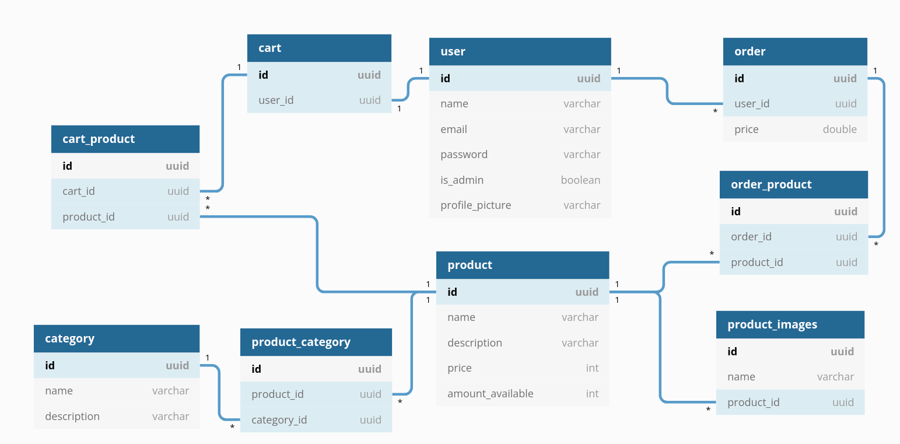

# E-Commerce

The ideia is to develop a simulation of an e-commerce, with the following entities:

 
 

## To-do list (road map)

* [ ] Category
    * [ ] Create
    * [ ] List
    * [ ] Update
    * [ ] Delete
* [ ] Product
    * [ ] Create
    * [ ] List
    * [ ] Update
    * [ ] Delete
    * [ ] Filter
* [ ] User
    * [ ] Create
    * [ ] List
    * [ ] Update
    * [ ] Delete
    * [ ] Filter
* [ ] User login
* [ ] User admin token to operate the system
* [ ] Add and remove products from the shop cart
* [ ] Search user's shop cart by user id
* [ ] Purchase products
* [ ] Upload product images
* [ ] Upload user profile picture
* [ ] User's purchase history

## Future features

* Product evaluation (rating with stars, description, pictures, etc)